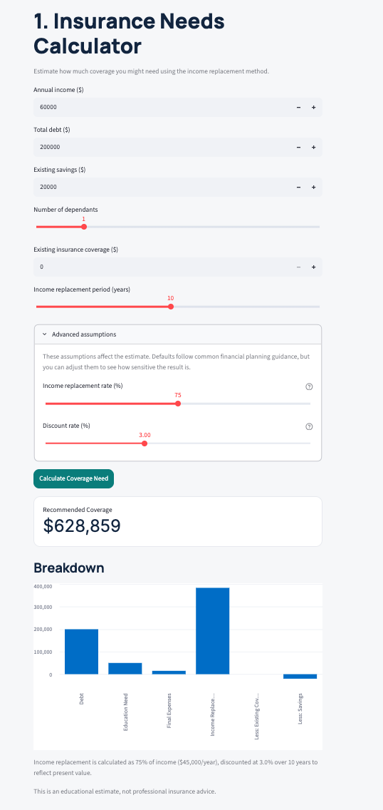
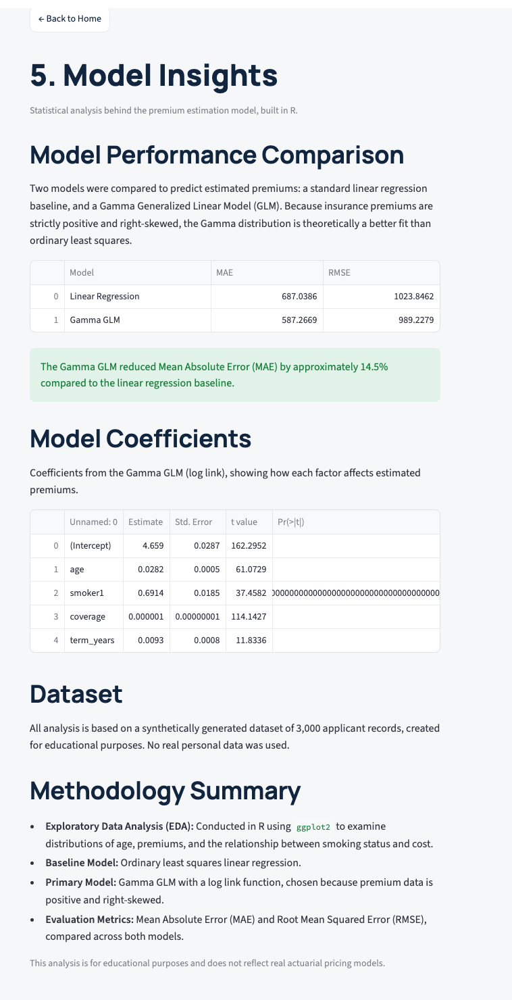

# Canadian Life Insurance Planning Tool

🔗 **[Live Demo](https://canadian-life-insurance-platform-j8tladavzd6mxlnrjj4ey2.streamlit.app)**

Educational life insurance analytics platform: coverage needs calculator, risk scoring,
illustrative premium estimation, product recommendation, and investment projection —
backed by statistical analysis in R.

⚠️ **Disclaimer**: This is a student portfolio project for educational purposes only.
It does not provide real insurance quotes or professional advice. All figures are
illustrative estimates. Please consult a licensed insurance advisor before making any
real coverage decisions.

## Screenshots

<!-- Drag screenshot images into the images/ folder in VS Code, then reference them here -->




## Features

- **Insurance Needs Calculator** — estimates required coverage using an income
  replacement method with present-value discounting (adjustable replacement rate and
  discount rate)
- **Product Recommendation** — rule-based scoring engine across four illustrative
  product types (Term 10 / 20 / 30, Permanent Life)
- **Risk Score** — a 0–100 illustrative risk score based on age, smoking status,
  BMI category, medical conditions, and occupation risk
- **Premium Estimator** — an illustrative premium formula combining base rate, age,
  smoking, health, and term factors
- **Investment Projection** — deterministic future value calculation plus a Monte
  Carlo simulation (1,000 paths) showing 10th / 50th / 90th percentile outcomes
- **Model Insights** — Gamma GLM vs. linear regression comparison, built in R

## Tech Stack

Python, Streamlit, R (ggplot2, GLM), Excel (openpyxl-generated sensitivity workbook)

## Repository Structure
'''
canadian-life-insurance-platform/
├── app.py # Home page / landing screen
├── pages/ # 5 tool pages (Needs, Recommendation, Premium,
│ Investment, Model Insights)
├── src/ # Core calculation modules + shared UI style
│ ├── needs_calculator.py
│ ├── risk_score.py
│ ├── recommendation.py
│ ├── premium_model.py
│ ├── investment_projection.py
│ └── ui_style.py
├── analysis/ # R scripts (EDA, GLM) + synthetic data generator
│ ├── generate_data.py
│ ├── eda.R
│ └── glm_model.R
├── results/ # Model performance & coefficient CSVs
│ ├── model_performance.csv
│ └── model_coefficients.csv
├── excel/ # Premium sensitivity analysis workbook
│ └── premium_analysis.xlsx
├── report/ # Full project report (PDF)
│ └── project_report.pdf
├── data/ # Synthetic applicant dataset (3,000 records)
│ └── raw/synthetic_applicants.csv
├── images/ # Screenshots used in this README
├── requirements.txt
└── README.md
'''
## How to Run Locally

```bash
git clone https://github.com/AliceChen29/canadian-life-insurance-platform.git
cd canadian-life-insurance-platform
pip install -r requirements.txt
streamlit run app.py
```

## Statistical Results

A synthetic dataset of 3,000 applicant records was used to compare two models for
predicting illustrative annual premiums: an ordinary least squares (OLS) baseline, and
a Gamma Generalized Linear Model (GLM) with a log link. Because premium data is
strictly positive and right-skewed, the Gamma distribution is theoretically a better
fit than a normal-error linear model.

| Model | MAE | RMSE |
|---|---|---|
| Linear Regression | $687.04 | $1,023.85 |
| **Gamma GLM** | **$587.27** | **$989.23** |

The Gamma GLM reduced Mean Absolute Error by approximately **14.5%** compared to the
linear regression baseline.

## Limitations

- Uses simplified, illustrative assumptions — not real actuarial mortality tables
- All statistical analysis is based on synthetically generated data; no real personal
  data was used anywhere in this project
- Not a substitute for advice from a licensed insurance advisor and does not
  constitute financial advice
- Does not model adverse selection, policy lapse rates, or full expense structures

## Future Improvements

- Incorporate published, anonymized mortality table structures for the premium model
- Add user accounts to save and compare multiple scenarios over time
- Extend the recommendation engine with a machine learning classifier, benchmarked
  against the current rule-based system
- Add French-language support, given the bilingual nature of the Canadian insurance
  market

## Author

Alice Chen